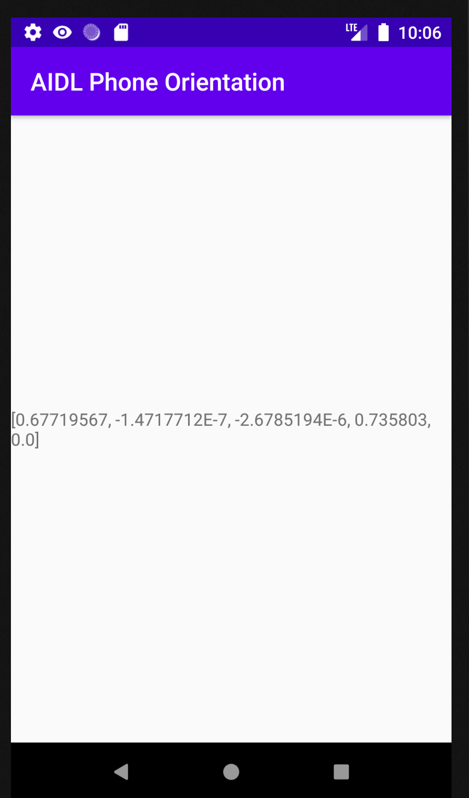

# AIDLPhoneOrientationDataMaster

## App Description:
This application returning phone orientation data using AIDL service 
and showing IMU data in a Textview

## Technical Description:
*	I have used own create Phone Orientation Data sdk 
*	SDK URL: https://github.com/darshna5/phoneorientationdata-library

## App Snapshot:

